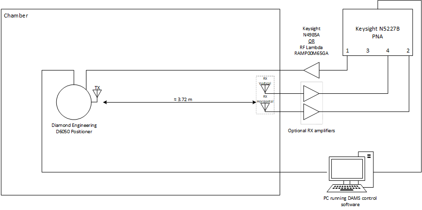

# General Documentation

This folder contains all of the documents explaining the various aspects of the
chamber.

## Available Measurement Horns

| Manufacturer    | Part No.                | Frequency Range [GHz]|
|-----------------|-------------------------|----------------------|
| ETS-Lindgreen   | 3164-10                 | 0.4 - 10             |
| ETS-Lindgreen   | 3164-10                 | 0.4 - 10             |
| SAGE Millimeter | SAC-0231831225-SF-S4-DP | 2 - 18               |
| SAGE Millimeter | SAC-0231831225-SF-S4-DP | 2 - 18               |
| Pasternack      | PE9854/SF-20            | 12.4 - 18            |
| Pasternack      | PE9854/SF-20            | 12.4 - 18            |
| Pasternack      | PE9852/SF-20            | 18 - 26.5            |
| Pasternack      | PE9852/SF-20            | 18 - 26.5            |
| SAGE Millimeter | SAC-1834031621-KF-S5-DP | 18 - 40              |
| SAGE Millimeter | SAC-1834031621-KF-S5-DP | 18 - 40              |
| Pasternack      | PE9850/2F-20            | 26.5 - 40            |
| Pasternack      | PE9850/2F-20            | 26.5 - 40            |
| SAGE Millimeter | SAC-2507-141-S2         | 58 - 68              |
| SAGE Millimeter | SAR-2507-15-S2          | 50 - 75              |

## Chamber Diagram

