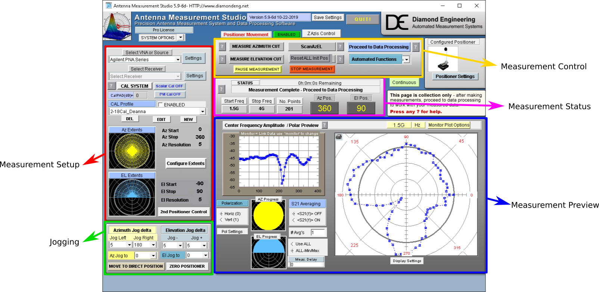
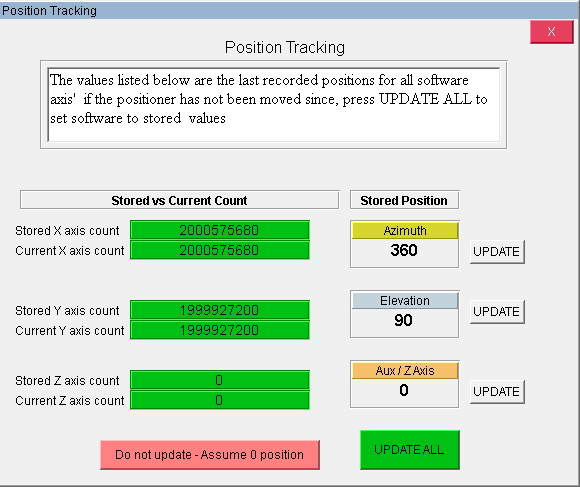
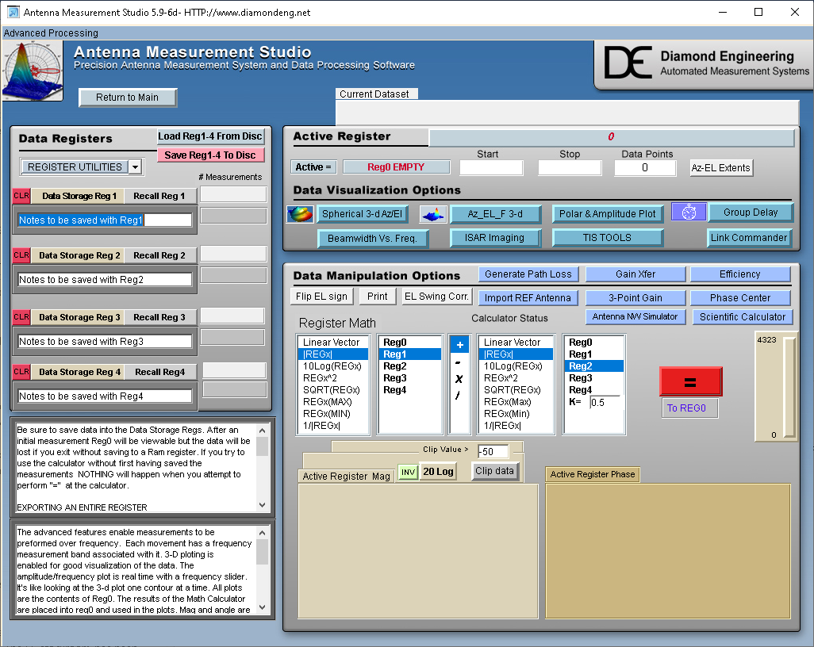

# DAMS Antenna Measurement Studio

## Overview

The Penn State anechoic chamber uses a Diamond Engineering positioner and its associated software to take measurements. This software is called "Desktop Antenna Measurement System", or DAMS.

For information beyond what is covered in this guide, see the [user manual](https://www.diamondeng.net/support/documents/damsmanual.pdf)

Diamond has also created several videos posted to their [YouTube channel](https://www.youtube.com/user/AntennaMeasurements/videos) that are quite helpful for a walkthrough of the software. The most basic of which is likely ["Making Basic Measurements with Diamond Engineering's DAMS Antenna Studio software"](https://www.youtube.com/watch?v=SkmYc3426D4)

## Don't close the window

When you've finished using DAMS, do not close the window with the Windows "X" button. Instead, you should return to the main screen, and use the "QUIT!" button at the top. This will save the current settings as default.

## It crashed!!

Unfortunately, crashes seem to happen often with DAMS. In the event of any kind of failure, the default behavior is to crash the program. This highlights how critical it is to save as often as possible. After you've set up your measurement, click "Save Settings" at the top of the window. After a measurement has concluded, and you've proceeded to data processing, the **first** thing you should do is save all your registers.

If a crash occurs, all you can do is reopen the software, confirm the positioner locations in the "positioner tracking" software and start over. If you do not save your settings, it will return to the most recently stored settings which could be a setup for a previous measurement. **SAVE OFTEN**

## Interface

The picture above shows the home screen of DAMS with some key sections labled.

Starting from the top center and moving clockwise:

* **Measurement Control** - Contains buttons which enable you to start measurements of various cut-planes, a full Azimuth-Elevation scan, stop or pause measurements, and "proceed to data processing" which is what you click when measurements are finished and you want to manipulate or export your data.
* **Measurement Status** - Indicates the status of the current measurement in progress, including information about the frequency sweep as read from the PNA, the current position, and an estimate of the time remaining.
* **Measurement Preview** - Provides a live preview of the measurement in progress for a specific frequency. *NOTE*: this cannot be changed mid measurement so if you want to watch the live progress of a frequency of interest, you must select it before starting your measurement.
* **Jogging** - The dropdowns in this section will physically move the positioner. You can move both azimuth and elevation by a specified amount or jog to a direct position. This section also contains the button which allows you to define 0,0 for the current setup.
* **Measurement Setup** - This window controls the actual setup for the measurement including over what positions to sweep, the resolution of those positions, what PNA is being used, and the calibration.

## Using DAMS

These are the basic steps mentioned on the [main readme](/README.md) expanded with more detail.

1. Open DAMS
    * DAMS can be opened either by using the desktop shortcut or by navigating to C:\DAMS\ and opening DAMS5.exe
    * When you launch, you will see the following window
    

    This is asking you to confirm that the current positioner location matches the position stored by the software when it last closed. This is usually correct, and so clicking "UPDATE ALL" is often correct. If you know for certain the stored values are incorrect, click "Do not update - Assume 0 position" and set zero as described in the next step.
1. Maneuver the positioner to the "zero position" and set it as "zero"
    * Using the controls in the **Jogging** section, move the positioner such that it is at a position you define to be (0,0). Typically, this means boresight aligned to the receive antenna.
    * Click "Zero Positioner,"  then click "Set Zero" to define this position as (0,0)
1. Define the details of the measurement, e.g. over what angles the measurement will be taken, and at what intervals. Things like the frequency sweep, number of points, etc. are set on the network analyzer and read by DAMS when the measurement starts.
    * From the top to the botom of the **Measurement Setup** section, do the following
        * Click the dropdown under "Select VNA or Source" and select "Agilent.PNA.Series"
        * If you are using a calibration profile (from a calibration that's been done before), click the dropdown under "CAL Profile," choose your calibration, and click the checkbox labled "ENABLED"
        * Click "Configure Extents" to choose the positions and resolution of your measurement.
1. Set whether the measurement is a one or two plane measurement
    * If you are taking a dual polarization measurement, click the "SETTINGS" button next to the "Agilent.PNA.Series" dropdown
    * Choose the two measurements corresponding to the two polarizations (we typically use S21 on the left, and S41 on the right).
    * Check the checkboxes labled "H+V Using Alt-Param" and "Alternate Parameter"
    * Click "Settings" next to "H+V Using Alt-Param" and select the labels and destinations for the two polarizations (e.g. REG1 for V-Pol and REG2 for H-Pol).
    * Click "OK" then "Save"
1. Choose what frequency to monitor in the live plot
    * If you want to watch a live preview of a specific frequency, in the **Measurement Preview** section, click "Monitor Plot Options", use the slider to choose the frequency, then click "Exit"
1. Run whichever sweep is appropriate for your measurement (AzEl, Elevation, Azimuth)
    * In the **Measurement Control** section, click the button corresponding to the type of measurement you are taking.
1. After the measurement has concluded, you can click "Proceed to Data Processing" to either manipulate or export your data. The **first** thing you should do is save all registers to disk.

## Proceed to Data Processing

After your measurement has finished, you can click "Proceed to Data Processing" which will bring up this window

**THE FIRST THING YOU SHOULD DO IS SAVE YOUR DATA.** Again to underscore the importance here, in the event of a crash, all data in registers will be lost. If you do not save, you will have to repeat your measurement which could take as long as several hours. The first thing you should do is click "Save Reg 1-4 To Disc" and save the .dat file.

From this window, you can either plot, manipulate, or export your data.

### Export Data to Excel

To export all registers to an excel file (which can be easily manipulated with Python or MATLAB etc.):

* Click the dropdown arrow beside "REGISTER UTILITIES"
* Select "Excel Reg. Export (Beta)." You will likely want to export all registers, so in the window just choose "Register 1" and in the enxt window you can export all.
* In this window, you can change some metadata that will appear in the file if you want, but to export all registers to one excel file, check the checkbox labeled "Export All Regs 1-4" and click "EXCEL EXPORT"

### Plotting

The plotting options will operate on "Register 0" which is the actively loaded register. i.e. to plot Register 1 (which might be vertical polarization), Click "Recall Reg 1" to load Register 1 into Register 0. You can then click the button corresponding to whichever visualization you want to look at.
