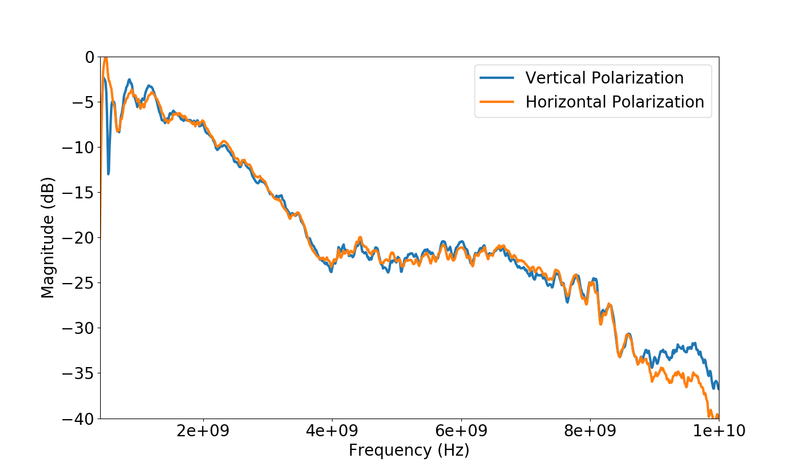

# ETS-Lindgren 3164-10

| Parameter               | Value    |
|-------------------------|----------|
| Frequency Range \[GHz\] | 0.4 - 10 |

The two .s2p files in this directory cover the frequency range of the horn and
were taken with the two horns pointed directly aligned, boresight, approximately
aligned with the standard positioner mast.

The following code was used to generate the plots at the end of this page:

```python
import skrf
import matplotlib
import matplotlib.pyplot as plt

matplotlib.rc('font', size=20)

vert = skrf.Network("Saber_Vert.s2p")
horz = skrf.Network("Saber_Horz.s2p")
vert.s21.plot_s_db(linewidth=3, label="Vertical Polarization")
horz.s21.plot_s_db(linewidth=3, label="Horizontal Polarization")

axes = plt.gca()
axes.set_ylim([-40,-0])

plt.show()
```


